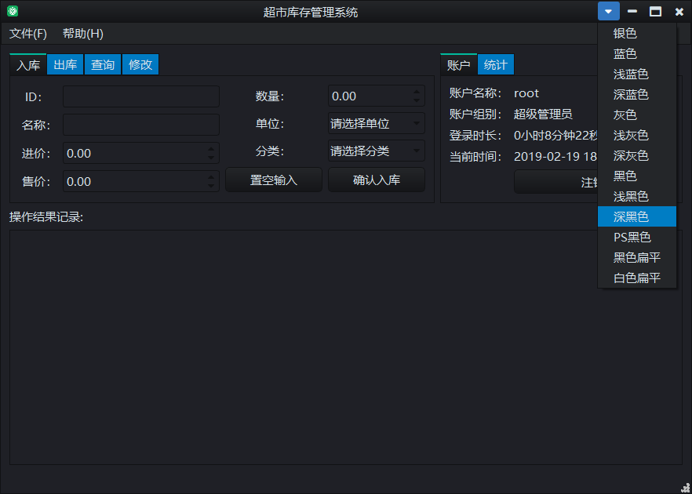
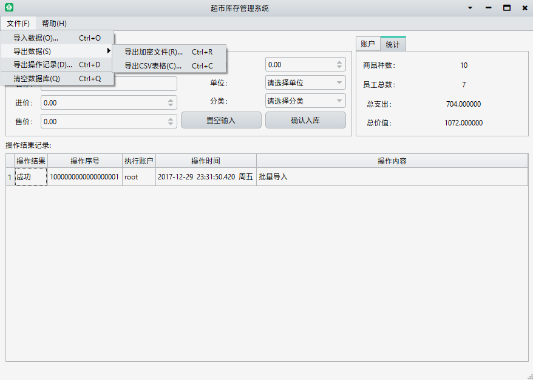

# 中文版本

## NEUSupermarket 说明

这是一个基于Qt5.0的超市货物管理系统，东北大学计算机科学与技术专业大二上学期数据结构大作业之一。之二见https://github.com/qiziqiang/Grades

其中root账户密码为qqqzq。

### 特性

- 高性能（核心为C++动态链表实现，可实现100万行级别数据导入导出）
- 界面美观（QSS实现）
- 独有qzq格式加密（DES加密方式实现）
- 多人账户管理体系（目前root账户全部权限，其他用户没有批量导出和删除权限）
- 有操作历史记录

### TODO

本项目作为交作业所作，不再更新。

### 许可协议

我不想写太官方的协议，你大概也不想看。所以有需要的同学可以直接拿去，不必知会作者。作者不保留任何权利，亦不承担任何后果，有问题可以联系作者：rykerqi@gmail.com。

--- 

# English version

## NEUSupermarket note

This is a supermarket goods management system based on Qt5.0. The data structure assignment of the sophomore year of computer science and technology major of Northeast University.

The root account password is qqqzq.

### Characteristics

- High performance (core is C++ dynamic linked list implementation, can achieve 1 million row level data import and export)
- Beautiful interface (QSS implementation)
- Unique QZQ format encryption (DES encryption)
- Multi-user account management system (at present, all rights of root account, other users do not have the right to export and delete in batches)
- Operational history

### TODO

This project is handed in as an assignment and will not be updated.

### License agreement

I don't want to write too official an agreement, and you probably don't want to read it either. So students who need it can take it directly without knowing the author. The author does not reserve any rights or bear any consequences. If you have any questions, please contact author: rykerqi@gmail.com.
